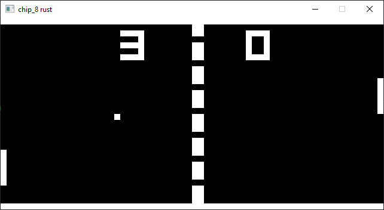

# Chip-8 interpreter in RUST
A basic Chip-8 interpreter to learn how an emulator works.

# Dependancies
- Cmake

# Commands
´´´Bash

cargo run

```

# Example
*My chip-8 interpreter executing a simple IBM logo showing rom.*


*The Pong Game*




## Resources
- [Guide to make a chip-8 emulator without code](https://tobiasvl.github.io/blog/write-a-chip-8-emulator/)
- [Guide to make a chip-8 emulator in C++](https://multigesture.net/articles/how-to-write-an-emulator-chip-8-interpreter/)
- [chip-8 Wikipedia](https://en.wikipedia.org/wiki/CHIP-8#Virtual_machine_description)
## Credits
- [Raylib rs](https://github.com/deltaphc/raylib-rs)
